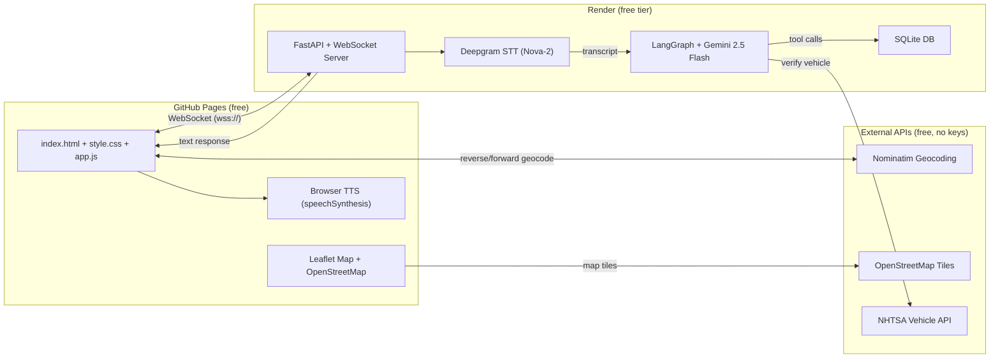

# Roadside Rescue — Voice-Agent for Stranded Drivers

A real-time voice AI agent that helps stranded drivers report vehicle breakdowns and book mobile mechanics — entirely through conversation, no typing required. Features an interactive map with GPS auto-detection and reverse geocoding.

## Why Voice?

A driver broken down on a highway can't safely navigate a mobile app. Voice is the only interface that keeps hands free and eyes on traffic while securing help.

## Architecture

**Split deployment: GitHub Pages (frontend) + Render (backend) — both free.**



### Data Flow (Voice Round-Trip)

```
1. Browser captures mic audio → streams over WebSocket to Render
2. Server forwards audio to Deepgram STT → receives transcript
3. First utterance includes GPS SystemMessage with address + zip
4. LangGraph (Gemini 2.5 Flash) processes + may invoke tools
5. LLM response sent back to client as JSON
6. Browser speaks response via Web Speech API
7. Client parses response → updates map pin, status card, vehicle/booking info
```

### GPS & Location Flow

```
Page Load → navigator.geolocation → Nominatim reverse geocode
         → Map pin placed + status shows "Confirming..."
         → Location sent to server via WebSocket

First Utterance → Server injects GPS as SystemMessage
               → Agent confirms: "I see you're near X, 98122. Is that right?"

User Confirms → Status card updates to "Street, City, Zip"
User Corrects → Client forward geocodes new address
             → Map pin moves + status updates
```

| Component | Technology |
|-----------|----------|
| Frontend | GitHub Pages (static HTML/CSS/JS), deployed via GitHub Actions |
| Backend | FastAPI + WebSockets on Render (free tier) |
| Map | Leaflet.js + OpenStreetMap tiles (free, no API key) |
| Geocoding | Nominatim reverse + forward geocoding (free, no API key) |
| Speech-to-Text | Deepgram Nova-2 |
| LLM | Google Gemini 2.5 Flash (free tier) |
| Text-to-Speech | Browser Web Speech API (free) |
| Orchestration | LangGraph (Python) |
| Vehicle Verification | NHTSA Vehicle API (free, no API key) |
| Storage | SQLite |
| Evaluation | LangSmith |

### Real Public API Integrations

| API | What It Does | Auth |
|-----|-------------|------|
| [Deepgram](https://deepgram.com/) | Streaming speech-to-text (Nova-2 model) | API key (free $200 credit) |
| [Google Gemini](https://ai.google.dev/) | LLM for conversation + tool calling (2.5 Flash) | API key (free tier) |
| [NHTSA Vehicle API](https://vpic.nhtsa.dot.gov/api/) | Validates vehicle make/model/year combinations | None (free government API) |
| [Nominatim / OpenStreetMap](https://nominatim.openstreetmap.org/) | Reverse + forward geocoding (GPS → address) | None (free, 1 req/sec policy) |
| [OpenStreetMap Tiles](https://www.openstreetmap.org/) | Interactive map tiles via Leaflet.js | None (free, open data) |
| [LangSmith](https://smith.langchain.com/) | LLM tracing and evaluation | API key (free tier) |

## Quick Start (Local Development)

```bash
# 1. Clone and install
git clone https://github.com/sennatitcomb/Roadside-Rescue-AI-Agent.git
cd Roadside-Rescue-AI-Agent
pip install -r requirements.txt

# 2. Set up environment variables
cp .env.example .env
# Fill in: GOOGLE_API_KEY, DEEPGRAM_API_KEY

# 3. Initialize database
python -m server.db.seed

# 4. Run backend server
uvicorn server.main:app --reload

# 5. Open client
# Open client/index.html in your browser (or serve via Live Server)
# For local dev, app.js defaults to ws://localhost:8000/ws
```

## Deployment

- **Frontend** → GitHub Pages via GitHub Actions workflow (deploys `client/` directory on push to `main`)
- **Backend** → Connect repo to [Render](https://render.com) free tier, set env vars (`GOOGLE_API_KEY`, `DEEPGRAM_API_KEY`)
- **Live demo**: [sennatitcomb.github.io/Roadside-Rescue-AI-Agent/](https://sennatitcomb.github.io/Roadside-Rescue-AI-Agent/)

## Project Structure

```
├── PLAN.md                     # Full architecture & execution plan
├── .env.example                # API keys template
├── render.yaml                 # Render deployment config
│
├── .github/workflows/
│   └── deploy-pages.yml        # GitHub Actions → deploys client/ to Pages
│
├── server/                     # BACKEND (Render free tier)
│   ├── main.py                 # FastAPI + WebSocket server + GPS injection
│   ├── stt.py                  # Deepgram streaming client
│   ├── graph/                  # LangGraph state machine
│   │   ├── state.py            # ConversationState TypedDict
│   │   ├── nodes.py            # Agent node + tool wrappers
│   │   └── builder.py          # Graph compilation
│   ├── tools/                  # LLM tool functions
│   │   ├── verify_vehicle.py   # NHTSA API vehicle validation
│   │   ├── get_slots.py        # SQLite slot query (LIMIT 3)
│   │   └── book_mechanic.py    # Booking creation
│   ├── prompts/
│   │   └── system.py           # System prompt (location-first workflow)
│   └── db/
│       ├── schema.sql          # Table definitions
│       └── seed.py             # 7 mechanics across 4 zip codes
│
├── client/                     # FRONTEND (GitHub Pages)
│   ├── index.html              # Leaflet map + status card + mic button
│   ├── style.css               # Dark theme with map styling
│   └── app.js                  # WebSocket, GPS, geocoding, transcript parsing
│
├── eval/                       # LLM-as-a-judge evaluation
└── tests/                      # Unit tests
```

## Features

### Interactive Map
- Leaflet.js map centered on GPS coordinates with a pin marker
- Reverse geocoding via Nominatim shows formatted address (street, city, zip)
- Map pin moves when user corrects their location
- Dark theme styling for map tiles and controls

### GPS Auto-Detection & Confirmation
- Browser GPS captured on page load
- Agent confirms location before asking about vehicle
- Location injected as a `SystemMessage` so the LLM treats it as authoritative
- Queuing mechanism ensures GPS data reaches server even if it resolves before WebSocket connects

### Smart Status Card
- **Location**: Shows "Confirming..." until agent verifies, then formatted address
- **Vehicle**: Auto-detected from conversation (handles year-first and year-last formats)
- **Phone**: Parsed from user speech, formatted as (XXX) XXX-XXXX
- **Booking**: Shows confirmation code when booked
- **Status**: Real-time state (Listening, Thinking, Speaking, Booked)

### Conversation Intelligence
- Parses user transcripts for zip codes and location corrections
- Parses agent responses for vehicle, booking, and location data
- Strips trailing prepositions from address extraction
- Skips geocoding when agent discusses slots/availability
- Stop-word filtering prevents dates from being mistaken for vehicles

## Tools (LLM Function Calling)

- **`verify_vehicle(make, model, year)`** — Validates vehicle via NHTSA Vehicle API
- **`get_available_slots(zip_code)`** — Returns top 3 soonest mechanic slots from SQLite
- **`book_mechanic(phone, zip_code, vehicle, slot_id)`** — Creates a booking record

## Database Coverage

| Zip Code | City | Mechanics |
|----------|------|-----------|
| 98101 | Seattle, WA (Downtown) | Mike Torres, Sarah Chen |
| 98109 | Seattle, WA (South Lake Union) | David Kim |
| 98122 | Seattle, WA (Capitol Hill) | Lisa Park |
| 90210 | Beverly Hills, CA | James Okafor, Priya Patel |
| 73301 | Austin, TX | Carlos Rivera |

## Evaluation

Conversations are traced with LangSmith and graded by an LLM-as-a-judge on:
1. **Parameter Extraction** — Did it capture make, model, year, location?
2. **Tool Execution** — Did it successfully book a mechanic?
3. **Conversational Resilience** — Did it handle ambiguous input gracefully?

## Known Limitations

- The SQLite booking system intentionally lacks concurrency control — simultaneous bookings can conflict. This is a deliberate design choice for the POC.
- Nominatim has a 1 request/second usage policy — fine for single-user POC.
- Browser TTS quality varies by OS/browser. Safari (Samantha) and Chrome (Google voices) sound best.

---

See [PLAN.md](./PLAN.md) for the full architecture document and execution plan.
